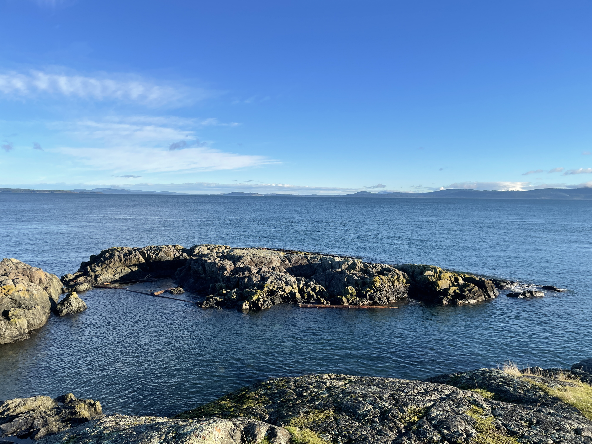
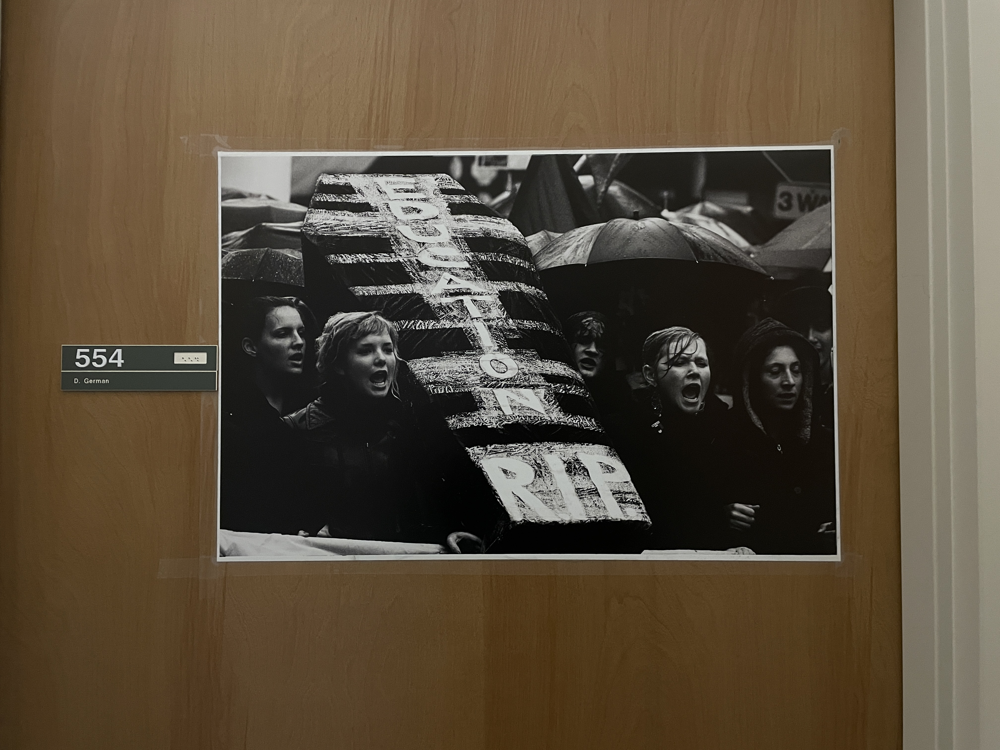

## Story

## Start Studying Abroad

Time: 12/22/2021 PST, maybe 7:00 am, I saw the Rocky Mountains on the Air Canada 025 and I known that I had arrived Canada and the visitin life would start. 

A few days ago, I finally got my Canda Visa and bought the airplane ticket with the help of CSC (China Scholarship Council, 国家留学基金委). At first I prepared to visit the University of Southampton, but the visa was too difficult to apply because I had to ask the school for a COS code which it didn't grant for anyone in late 2021. I guessed it was the reason for the tense of international relations. So, I had to change the destination. At this place, I want to thank Prof. Shi, IEEE Fellow, who gave me a chance to use the scholarship of CSC. 

It was still not convinient because of the Delt Covid-19 virus was still running around the world, and all of us were worried about getting infected when going abroad. So, when I start to going aboard, I saw many students were wearing hazmat suits. I did not bought hazmat suit. I think it was very safe in China, the real dangerous were outside China at that time, why I had to wear an uncomfortable suit like that? Not to mention that this plane will not allow people board in the middle transfer airport. I don't know that whether they who in hazmat suits would recall this experience. It was a very long trip. 

When I got to Vancouver, I spent 5 hours to change the visa. I had to complained that the efficient was so slowly in Canada. The first impression is not good. 

I rented a temporary house, actually, it was an attic over a garage to spend the following 2 weeks because the I house I rented for one year are not available at that time. The house owner is a white old man called Wayne, yeah, the Batman Wayne. He was really gental and he had visited over 80 countries around the world. He told me that it was not necessary to worry about the life in the future, what I would live with are just people. Actually, he was right. I got the same conclusion when I finished the visiting life. 

The cooking materials are rare in the temporary house. I had to bought some in the next day, and I first saw the milestone of University of Victoria. It is too expensive buying food in Victoria. And I found a bug, I can't use high temperature to cook Chinese because it would generate smoke and trigger the smoke alert. 

## Get Used to the Life in Canada

Seven days later, the house owner told me that the house I rent was available. Your house is huge, my friend told me. At first I did not beleive him until I realized that the area I lived is just a small part of this house. 

After the snow vanished, I saw the beautiful environment in Victoria. The house owner told me that this is the most beautiful city in Canada, much prettier than East. He was right! I nearly got a feel of my child life in Taigu, clear sky and green grass. My friend told me that he had prepared a lot of anti-allergic drugs to alleviate the symptom of rhinitis, but after he arrived in Victoria, he noticed that these drugs were waste of money, the air is really good there. 

My house was near the sea, it only took 5min to walk to the seashore, the daily exercise was going to the seaside and taking pictures. The sea in the cold zone is different from the sea in the tropics. There is no golden beach and no small fine sands, no people enjoy sunbathing. In addition to rocks, there are only stones on the seashore. But the water is very clear, I can see the bottom of the sea on this rock cliff.

Few days later, I went to the Lab. This lab is just a temporary place to place students. This is my station. Not large but suffient. 

There were many Professors would like to pin some interesting pictures on their doors, most of them were realy funny and showing their non-mainstream personality. It is not common in China. In China we only want to make the door clean. 

There were many animals in Victoria, in UVic school yard. They did not afraid of people very much, but they did not get in touch with human, too. I saw peacocks in the school yard wondering through the crowd. And deers eating grass or relax beside the main street, and node to me when I said "Hi" to them. 

<!--  -->
Continue...

