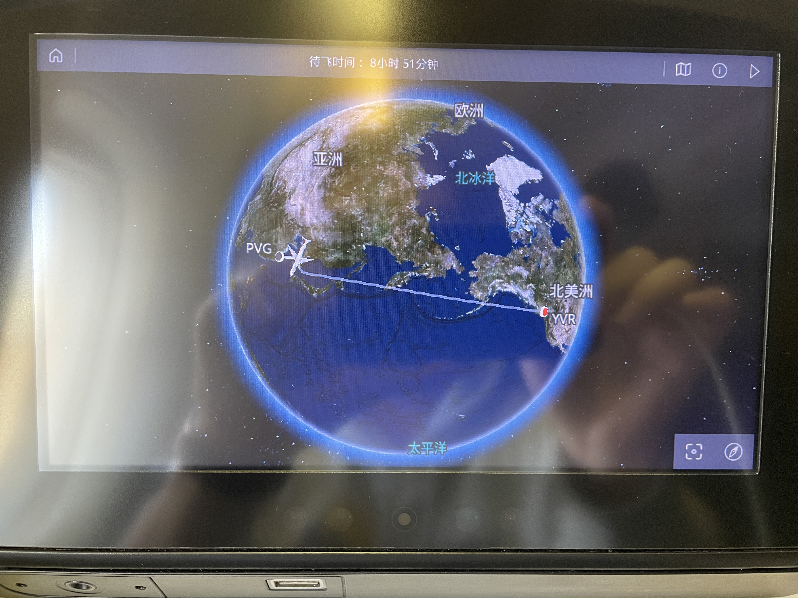
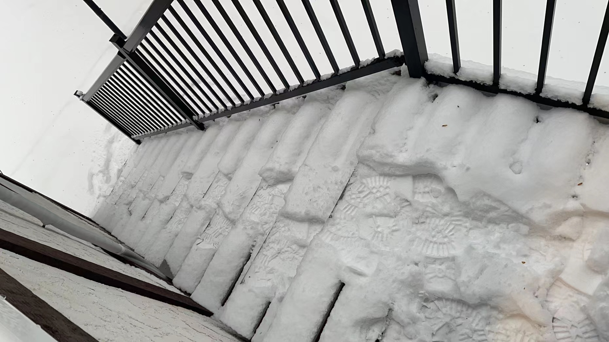

## Story

## Start Studying Abroad

Time: 12/22/2021 PST, maybe 7:00 am, I saw the Rocky Mountains on the Air Canada 025 and I known that I had arrived Canada and the visitin life would start. 

A few days ago, I finally got my Canda Visa and bought the airplane ticket with the help of CSC (China Scholarship Council, 国家留学基金委). At first I prepared to visit the University of Southampton, but the visa was too difficult to apply because I had to ask the school for a COS code which it didn't grant for anyone in late 2021. I guessed it was the reason for the tense of international relations. So, I had to change the destination. At this place, I want to thank Prof. Shi, IEEE Fellow, who gave me a chance to use the scholarship of CSC. 

It was still not convinient because of the Delt Covid-19 virus was still running around the world, and all of us were worried about getting infected when going abroad. So, when I start to going aboard, I saw many students were wearing hazmat suits. I did not bought hazmat suit. I think it was very safe in China, the real dangerous were outside China at that time, why I had to wear an uncomfortable suit like that? Not to mention that this plane will not allow people board in the middle transfer airport. I don't know that whether they who in hazmat suits would recall this experience. It was a very long trip. 

When I got to Vancouver, I spent 5 hours to change the visa. I had to complained that the efficient was so slowly in Canada. The first impression is not good. 

I rented a temporary house, actually, it was an attic over a garage to spend the following 2 weeks because the I house I rented for one year are not available at that time. The house owner is a white old man called Wayne, yeah, the Batman Wayne. He was really gental and he had visited over 80 countries around the world. He told me that it was not necessary to worry about the life in the future, what I would live with are just people. Actually, he was right. I got the same conclusion when I finished the visiting life. 

The cooking materials are rare in the temporary house. I had to bought some in the next day, and I first saw the milestone of University of Victoria. It is too expensive buying food in Victoria. And I found a bug, I can't use high temperature to cook Chinese because it would generate smoke and trigger the smoke alert. 

## Get Used to the Life in Canada

    
     
    
The house I lived for one year

Seven days later, the house owner told me that the house I rent was available. Your house is huge, my friend told me. At first I did not beleive him until I realized that the area I lived is just a small part of this house. 

Continue...

<!-- It talks about my own study research of promote traditional martial art, [Xingyiquan (形意拳）](https://baike.baidu.com/item/%E5%BD%A2%E6%84%8F%E6%8B%B3/44041#:~:text=%E5%BD%A2%E6%84%8F%E6%8B%B3%EF%BC%8C%E5%8F%88%E7%A7%B0,%E5%90%88%EF%BC%8C%E6%89%8B%E4%B8%8E%E8%B6%B3%E5%90%88%E3%80%82). In old sayings, traditional kungfu is difficult to learn by one ownself from books or videos, because it is difficult to learn the key part of one action or one gesture without Master's guidance. I always want to use data science to record the precious traditional kungfu actions, and I know that this kind of data assets is better than books or videos because it provides a higher dimension to recognize one unique thing. Motion capture is a very hot topic in ACT games developments, and it has promoted many many good games. At a certain time, I led a small project and used inertial navigation sensors to calculate the motion trajectory of the human body and put them together to identify the entire human skeleton movement. It can provide detailed information for a person's movement, and it is easy to find the difference between two people who do the same action. Fortunately, I encountered an excellent documentary director who appreciated my thoughts, so we jointly presented this excellent short documentary. -->

